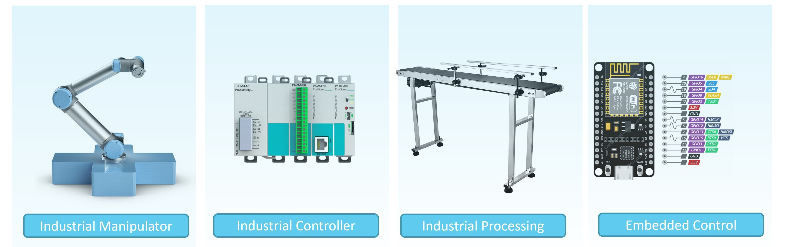

## Industrial Robotics Course
This repo supports the Texas A&M Lab for MXET400, titled industrial robotics.  It's a lab-based undergraduate course covering Industrial Automation, Manipulator robots, and embedded systems.

_diagram for four key technologies included in the lab_

## Lab Overview
Each lab session has tasks of interacting with a robotic lab bench setup, plus a few sensors & software elements operated at the students' computer.

### Conveyor & Robot System
The lab equipment is the basis for 1000 possible processes, but we established a basic demonstration which uses all of the key features.  The product is picked up by the robot arm, placed on the conveyor, sensed by a sensor, categorized by color, moved on conveyor, and stored in a rack.  Finally the product is sensed in the rack, and the industrial controller (PLC) verifies the process has completed.

>
> Instructional Video
>
> <iframe width="500" src="https://www.youtube.com/embed/30GM4m-Lyec" title="Program a PLC with Conveyor, Arduino and Industrial Robot" frameborder="0" allow="accelerometer; autoplay; clipboard-write; encrypted-media; gyroscope; picture-in-picture; web-share" referrerpolicy="strict-origin-when-cross-origin" allowfullscreen></iframe>
>

These two videos are posted on the homepage for quick visuals - find more videos & information on the Instructions tab (see sidebar menu).

>
> Demonstration Video
> 
>
> <iframe width="500" src="https://www.youtube.com/embed/ZBGswS26Dy4" title="Industrial robotics (MXET400) quick demo, conveyor, UR3e robot." frameborder="0" allow="accelerometer; autoplay; clipboard-write; encrypted-media; gyroscope; picture-in-picture; web-share" referrerpolicy="strict-origin-when-cross-origin" allowfullscreen></iframe>
>
