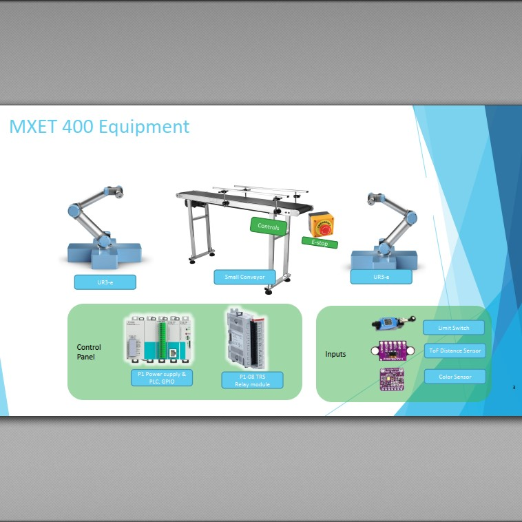

## Lab Content
Populating instructions for lab tasks

### Video Tutorial
This instruction shows the process flow for the initial version of the lab setup in 2021. 

<iframe width="700" src="https://www.youtube.com/embed/30GM4m-Lyec" title="Program a PLC with Conveyor, Arduino and Industrial Robot" frameborder="0" allow="accelerometer; autoplay; clipboard-write; encrypted-media; gyroscope; picture-in-picture; web-share" referrerpolicy="strict-origin-when-cross-origin" allowfullscreen></iframe>

### 2021 Lab Equipment

>Lab resources for initial offering of the labs was documented by David & passed to instructors & students, so they can modify as needed.
>
> 
>
> _preview of PDF, first slide, for introduction of the lab setup_
>
> [Download Slides](docs/LabIntro_2021.pdf)

## PLC Setup
Info about the PLC from AutomationDirect, as applied to our lab bench.

## MCU Setup
Info about the wireless arduino device ESP8266, as it is setup in our lab bench.

## Conveyor Setup
Info about our industrial mini-conveyor, as it is setup in our lab bench.
